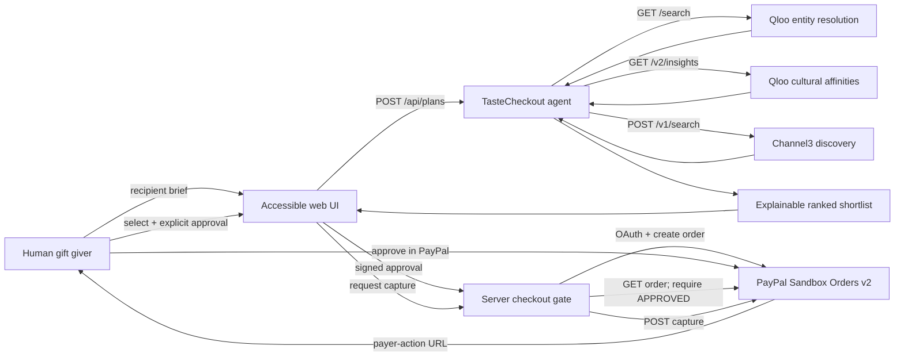

# Architecture

## Design goals

- Make Qloo essential to recommendation quality, not a decorative API call.
- Make PayPal essential to the transaction lifecycle, with credentials and calls server-side.
- Keep humans in control before order creation and require payer approval before capture.
- Use Channel3 only for the capability it currently documents as available: product discovery.
- Provide a truthful, deterministic demo that needs no keys and never implies that live providers were called.
- Keep the application installable with Node.js alone.

## System map



The diagram's browser-to-server arrows carry only recipient inputs, immutable plan identifiers, a signed approval token, and user actions. Qloo, Channel3, and PayPal credentials never enter browser code or API responses.

## Agent pipeline

### 1. Understand

The Qloo adapter resolves 2–6 human-readable tastes through `/search`. It then calls `/v2/insights` across brand, book, artist, and movie domains using the resolved entity IDs. Explainability is requested on every Insights call.

Output: seed entities, ranked cross-domain affinities, and a plain-language insight.

### 2. Discover

The agent builds one natural-language product query from:

- relationship and occasion;
- stated tastes;
- top Qloo affinities;
- optional personal context.

The Channel3 adapter sends that query to `POST /v1/search`. It normalizes products and offers, then removes candidates whose price is unavailable or far outside the budget. It does not call or emulate Channel3 checkout.

### 3. Decide

The local ranking stage applies a transparent weighted score:

- 58% cultural/taste token overlap;
- 27% budget fit;
- 15% discovery relevance;
- explicit penalties for avoid-list matches.

Every recommendation retains the Qloo affinity used in its explanation. Products above the hard budget ceiling are never shown.

### 4. Human approval

Planning creates no PayPal object. The server accepts checkout only if:

1. the selected product belongs to the stored recommendation set;
2. the HMAC token matches the immutable plan contents;
3. the UI sends the explicit confirmation phrase after the review checkbox is selected.

### 5. PayPal order lifecycle

The server obtains an OAuth token and calls `POST /v2/checkout/orders` on `https://api-m.sandbox.paypal.com`. It returns only the payer-action URL and a local order representation.

Capture is a separate call. Before capture, the server calls `GET /v2/checkout/orders/{id}` and requires status `APPROVED`. It then calls `POST /v2/checkout/orders/{id}/capture` with an idempotency key. Browser claims about payer approval are ignored.

## Adapter modes

| Adapter | Demo | Live |
| --- | --- | --- |
| Qloo | Seeded cultural expansion graph | Hackathon `/search` + `/v2/insights` |
| Catalog | Fixed fictional product catalog | Channel3 `POST /v1/search` |
| PayPal | In-memory `CREATED → APPROVED → COMPLETED` | Sandbox Orders v2 |

Modes are independent. This makes it possible to test one provider integration without hiding failures behind a silent fallback. Every response discloses which mode produced it.

## State machines

```text
Gift plan:
AWAITING_HUMAN_APPROVAL
  -> CREATING_ORDER
  -> PAYPAL_ORDER_CREATED
  -> COMPLETED

PayPal order:
CREATED
  -> APPROVED      (payer action, external to the agent)
  -> COMPLETED     (server capture after status verification)
```

Any failure during order creation rolls the gift plan back to `AWAITING_HUMAN_APPROVAL`. Capture from `CREATED` is rejected.

## Deployment

The process is a single Node.js HTTP server that serves the static frontend and same-origin JSON API. No database is required for judging. For production, replace `MemoryStore` with a transactional persistent store and move approval-secret management to the hosting platform's secret service.
